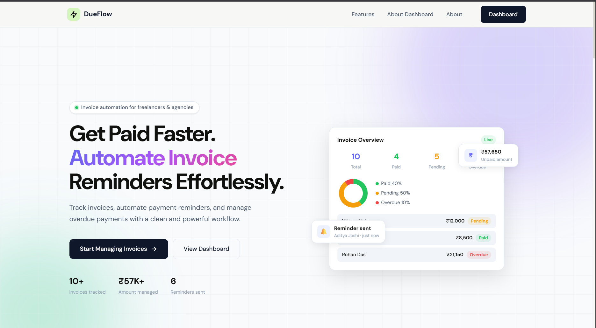
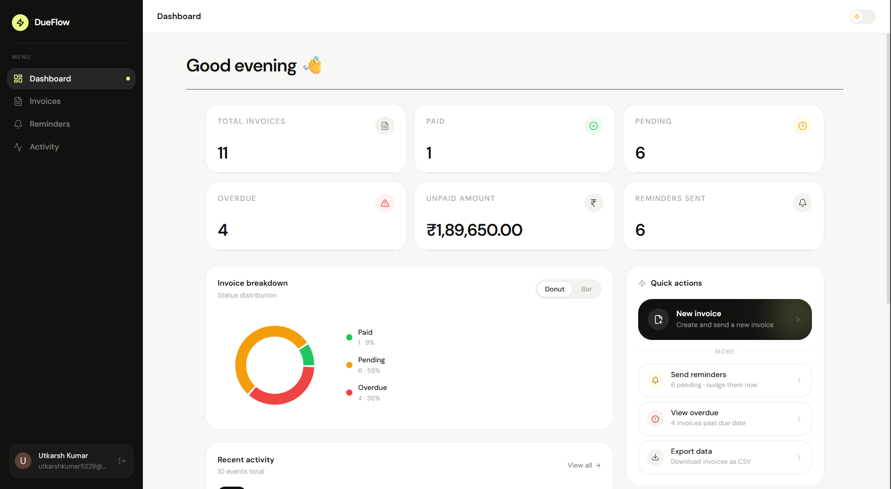
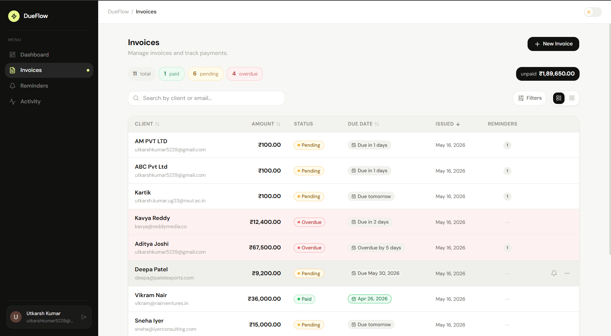
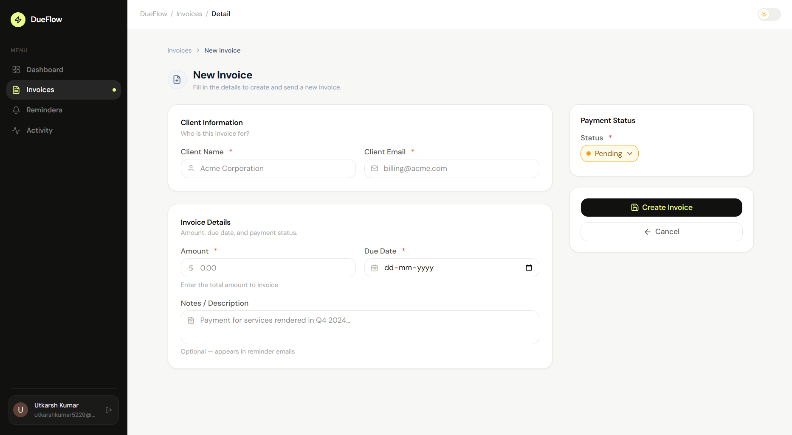
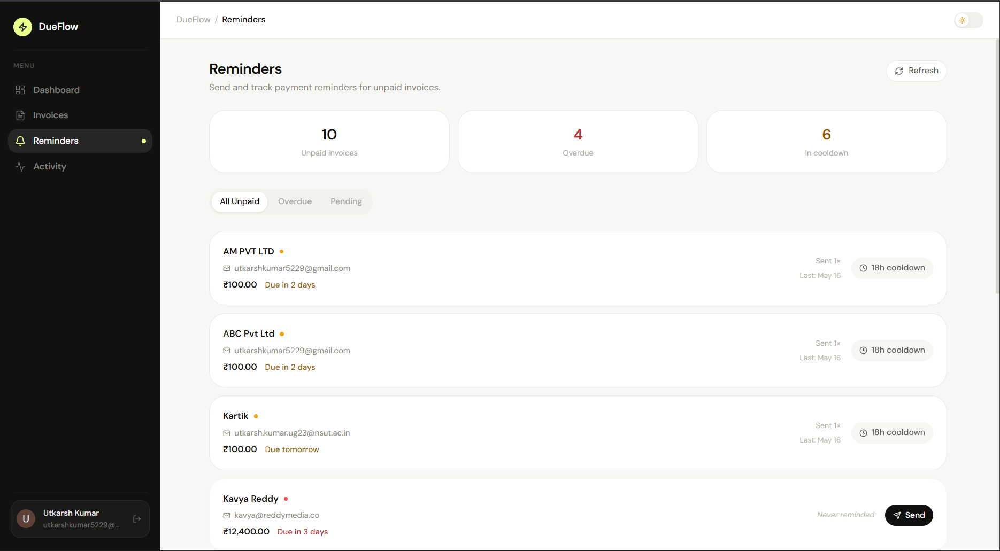
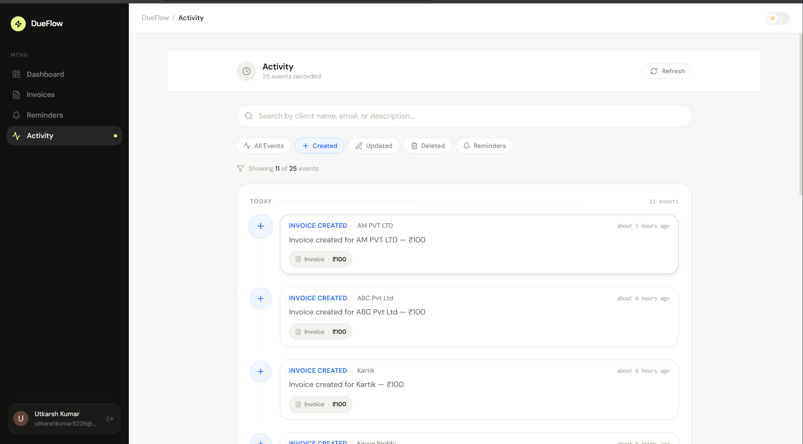

# DueFlow ⚡
 
> A modern invoice and payment reminder dashboard for freelancers and small businesses.
 
**Live Demo → [due-flow-zeta.vercel.app](https://due-flow-zeta.vercel.app)**
 
---
 
## Overview
 
DueFlow lets small businesses track who owes them money, manage invoice statuses, and send payment follow-up emails — all from a clean, fast dashboard.

---
 
## Features
 
- **Invoice Management** — Create, edit, delete invoices with client name, email, amount, due date, and notes
- **Status Tracking** — Invoices are automatically marked Overdue when their due date passes
- **Payment Reminders** — Send real reminder emails to clients with a 24-hour cooldown per invoice
- **Activity Feed** — Full audit trail of every action (created, updated, paid, overdue, reminder sent)
- **Dashboard** — High-level stats: total invoices, paid, pending, overdue, unpaid amount, reminders sent
- **Invoice Breakdown Chart** — Donut and bar chart views of invoice status distribution
- **Search & Filtering** — Search by client name or email; filter by status; sort by amount, due date, or date created
- **Dark Mode** — Full dark/light mode support with system preference detection
- **Multi-user Auth** — Each user sees only their own data; powered by Clerk
- **Responsive UI** — Works on desktop and mobile
---
 
## Tech Stack
 
| Layer | Technology |
|---|---|
| Frontend | React, Vite, Tailwind CSS, Recharts |
| Backend | Node.js, Express |
| Database | PostgreSQL (NeonDB) |
| ORM | Prisma |
| Auth | Clerk |
| Email | Resend |
| Deployment | Vercel (frontend), Render (backend) |
 
---
 
## Architecture
 
```
DueFlow/
├── frontend/          # React + Vite
│   └── src/
│       ├── pages/     # Dashboard, Invoices, Reminders, Activity
│       ├── components/
│       ├── hooks/
│       └── lib/api.js # Axios client with Clerk JWT
│
└── backend/           # Express REST API
    └── src/
        ├── controllers/
        ├── services/      # Business logic (invoiceService, reminderService, etc.)
        ├── middleware/    # Auth (Clerk), syncUser, asyncWrapper, validate
        ├── routes/
        └── lib/
```
 
The backend follows a clean **controller → service → Prisma** pattern. Controllers handle HTTP, services handle business logic, Prisma handles data.
 
---
 
## Key Engineering Decisions
 
### Auth — Clerk over custom auth
Clerk handles JWT issuance, session management, and OAuth. Clerk's `requireAuth` middleware verifies tokens on every request; the extracted `userId` is passed down through every service call to scope all data to the authenticated user.
 
### Email — Resend over Nodemailer
Nodemailer with Gmail SMTP is blocked on most cloud hosting providers (Render, Railway, Vercel) due to restricted outbound ports. Resend uses a simple HTTP API that works reliably in any environment.
 
> **Note on email delivery:** Resend's free tier without a verified domain can only send emails to the address used to register the Resend account. In a production deployment, a verified domain would be added to enable delivery to any client email address.
 
### Overdue Detection — Sync on read, not cron
Rather than running a scheduled job, overdue status is synced automatically on every `getAll` and `getById` call via `overdueService.syncOverdue()`. A full scan also runs on server startup. This keeps the system consistent without requiring external job schedulers.
 
### Reminder Cooldown — 24-hour rate limiting
Each invoice has a 24-hour cooldown between reminders to prevent accidental spam. The cooldown status is surfaced in the UI so users know when they can send again.
 
### Per-user Data Isolation
Every database query is scoped by `userId`. Ownership is verified on every mutation — attempting to access another user's invoice returns a `403 Forbidden`. A `syncUser` middleware automatically creates a `User` record in the database on first API request, linking Clerk's auth identity to Prisma's data layer.
 
---
 
## Data Model
 
```prisma
User      { id (Clerk userId), invoices[], activities[] }
Invoice   { id, userId, clientName, clientEmail, amount, dueDate, status, notes, reminders[], activities[] }
Reminder  { id, invoiceId, sentAt, count }
Activity  { id, invoiceId, userId, type, description, createdAt }
```
 
---
 
## Local Setup
 
### Prerequisites
- Node.js 18+
- PostgreSQL database (or a free [NeonDB](https://neon.tech) instance)
- [Clerk](https://clerk.com) account (free)
- [Resend](https://resend.com) account (free)
### Backend
 
```bash
cd backend
npm install
```
 
Create `backend/.env`:
```env
DATABASE_URL=postgresql://...
DIRECT_URL=postgresql://...
CLERK_SECRET_KEY=sk_test_...
RESEND_API_KEY=re_...
CLIENT_URL=http://localhost:5173
```
 
```bash
npx prisma migrate dev
npx prisma db seed
npm run dev
```
 
### Frontend
 
```bash
cd frontend
npm install
```
 
Create `frontend/.env`:
```env
VITE_API_URL=http://localhost:3001/api
VITE_CLERK_PUBLISHABLE_KEY=pk_test_...
```
 
```bash
npm run dev
```
 
---
 
## API Endpoints
 
| Method | Endpoint | Description |
|---|---|---|
| GET | `/api/dashboard` | Stats, chart data, recent activity |
| GET | `/api/invoices` | List invoices (supports `status`, `search`, `sortBy`, `order`) |
| POST | `/api/invoices` | Create invoice |
| PATCH | `/api/invoices/:id` | Update invoice |
| PATCH | `/api/invoices/:id/pay` | Mark as paid |
| DELETE | `/api/invoices/:id` | Delete invoice |
| POST | `/api/reminders/:invoiceId/send` | Send reminder email |
| GET | `/api/reminders/:invoiceId/cooldown` | Check cooldown status |
| GET | `/api/activity` | Full activity feed |
 
All endpoints require a valid Clerk JWT (`Authorization: Bearer <token>`).
 
---

## Screenshots
 






